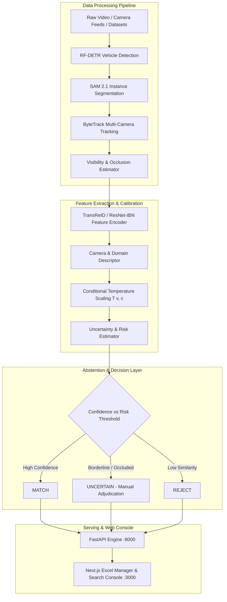

# 🚘 Uncertainty-Calibrated Vehicle Re-Identification & Intelligence Platform

> **Cross-camera vehicle matching and tracking with calibrated uncertainty estimation, risk-controlled abstention (`MATCH` / `UNCERTAIN` / `REJECT`), and high-performance CSV dataset management.**

---

## 📐 System Architecture Diagram



---

## ✨ Key Features & Capabilities

- **10,000+ Record Dataset Support**: Includes an automated dataset processing engine and synthetic VeRi generator producing structured CSV manifests (`veri776_train.csv`, `veri776_query.csv`, `veri776_gallery.csv`, `veri776_all.csv`).
- **Interactive Excel-Style Web Console**:
  - Virtualized spreadsheet grid rendering thousands of records instantly.
  - Column sorting (asc/desc), per-column filter inputs, and one-click cell copying.
  - Quick statistics bar tracking unique identities, camera counts, plates, and visibility confidence.
- **Uncertainty Calibration & Abstention**:
  - Replaces raw Cosine/L2 distance with risk-bounded confidence calibration.
  - Abstains on ambiguous or highly occluded vehicle images with `UNCERTAIN` for human review.
- **Hybrid Search Engine**:
  - **CSV-based streaming search**: Full-text searching across dataset manifests without requiring FAISS pre-indexing.
  - **Vector gallery search**: FAISS vector index matching for real-time photo-to-photo and license plate lookup.

---

## 🛠️ Project Stack & Technologies

| Layer | Technology | Purpose |
|---|---|---|
| **Backend Engine** | Python 3.11, FastAPI, Uvicorn | REST API endpoints, streaming CSV search, audit log |
| **Frontend UI** | Next.js 14, TypeScript, Tailwind CSS | Excel-style dataset manager, real-time search console |
| **Computer Vision** | PyTorch, TransReID, ResNet-IBN | Deep feature extraction and vehicle re-identification |
| **Detection & Seg** | RF-DETR, SAM 2.1, YOLOv8 | Bounding box detection, instance segmentation |
| **Tracking & Search** | ByteTrack, FAISS | Multi-camera tracking & vector similarity search |

---

## 📋 Comprehensive Makefile Commands Guide

The repository includes a root `Makefile` providing shortcuts for development, testing, training, and deployment:

```bash
make help          # Displays all available make commands and descriptions
make setup         # Installs Python dependencies, Node packages, and pre-commit hooks
make test          # Runs unit test suite
make test-all      # Runs full test suite including slow & GPU integration tests
make serve         # Starts the FastAPI backend engine on port 8000
make web           # Starts the Next.js frontend web console on port 3000
make run           # Runs both backend and frontend concurrently
make lint          # Executes ruff, black, and import-linter checks
make format        # Automatically formats Python codebase with ruff and black
make typecheck     # Performs strict static typing checks with mypy
make security      # Runs static analysis (bandit) and dependency security audit (pip-audit)
make benchmark     # Measures latency, memory, and throughput for calibrators
make docker-up     # Spins up Docker Compose stack (API + Web Console + MLflow)
make docker-down   # Stops Docker Compose services
```

---

## 📜 Shell Scripts (`scripts/`) Reference

All automation scripts are organized under the `scripts/` directory:

| Script Name | Language | Purpose & Description |
|---|---|---|
| `generate_veri_dataset.py` | Python | Generates synthetic VeRi-776 CSV dataset manifests up to 10,000+ records. |
| `process_dataset.py` | Python | Extracts & processes any vehicle dataset ZIP archive into normalized CSV manifests. |
| `build_gallery_index.py` | Python | Builds FAISS vector index and SQLite metadata store for fast visual retrieval. |
| `benchmark.py` | Python | Benchmarks latency and parameter efficiency of all calibration methods. |
| `mine_occluders.py` | Python | Mines occlusion patterns from raw dataset images for robust training. |
| `prepare_splits.py` | Python | Generates leakage-free train / query / gallery splits. |
| `setup.sh` | Shell | Automated environment initialization script for Linux/macOS. |
| `train_safe.sh` | Shell | Overnight training wrapper with auto-restart from checkpoint on OOM or crash. |
| `deploy.sh` | Shell | Terraform deployment wrapper for staging and production environments. |
| `pin_base_images.sh` | Shell | Pin container base image digest hashes for secure deployments. |

---

## ⚡ Quick Start: Local Execution

### 1. Clone & Setup Environment

```bash
git clone https://github.com/Tharungowdapr/CV-project.git
cd CV-project

# Run make setup OR manual setup:
python -m venv .venv
# On Windows:
.venv\Scripts\activate
# On Linux/macOS:
source .venv/bin/activate

pip install -e .
```

### 2. Launch Local Servers

**Option A: Using Makefile**
```bash
make serve   # Starts FastAPI Backend on http://localhost:8000
make web     # Starts Next.js Console on http://localhost:3000
```

**Option B: Manual Terminal Execution**
```bash
# Terminal 1: Backend
uvicorn reiduq.serving.app:app --reload --port 8000

# Terminal 2: Frontend
cd apps/web
npm run dev
```

---

## 📁 Clean Repository Structure

```
.
├── apps/
│   └── web/                # Next.js 14 frontend console & Excel grid UI
├── configs/                # YAML configuration files for models and experiments
├── data/
│   └── processed/          # 10,000 record CSV manifests (veri776_all.csv, etc.)
├── docs/                   # System design, API docs, data cards & ethics
├── infra/                  # Terraform IaC configurations for deployment
├── docker/                 # Container Dockerfiles & docker-compose configurations
├── scripts/                # Utility, pipeline, and benchmark scripts
├── src/
│   └── reiduq/             # Core Python framework package
│       ├── abstention/     # Risk-bounded decision logic
│       ├── calibration/    # Conditional temperature scaling
│       ├── detection/      # RF-DETR & YOLOv8 vehicle detectors
│       ├── models/         # TransReID & ResNet-IBN backbones
│       ├── search/         # Hybrid CSV/FAISS search engine
│       └── serving/        # FastAPI REST API endpoints
├── tests/                  # Unit, integration, property, and security tests
├── Makefile                # Automation commands
└── pyproject.toml          # Python package build & tool configuration
```

---

## 📜 License

Distributed under the MIT License. See `LICENSE` for details.
