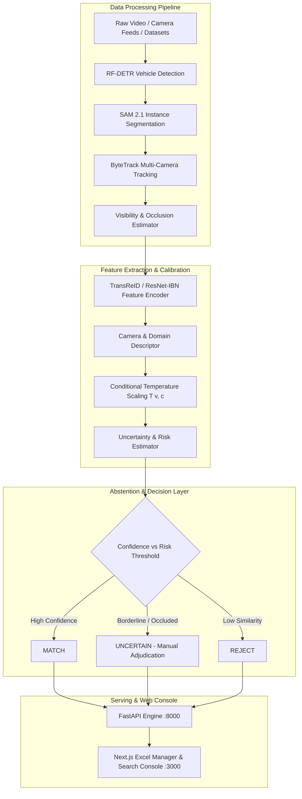

# 🚘 Uncertainty-Calibrated Vehicle Re-Identification & Intelligence Platform

> **Cross-camera vehicle matching and tracking with calibrated uncertainty estimation, risk-controlled abstention (`MATCH` / `UNCERTAIN` / `REJECT`), and high-performance CSV dataset management.**

---

## 📐 System Architecture Diagram



---

## ✨ Features & Highlights

- **10,000+ Record Dataset Support**: Out-of-the-box synthetic generator and automated ZIP ingest pipeline producing structured CSV manifests (`veri776_train.csv`, `veri776_query.csv`, `veri776_gallery.csv`, `veri776_all.csv`).
- **Interactive Excel-Style Web Console**:
  - Virtualized spreadsheet grid rendering thousands of records instantly.
  - Column sorting (asc/desc), per-column filter inputs, and one-click cell copying.
  - Quick statistics bar tracking unique identities, camera counts, plates, and visibility confidence.
- **Uncertainty Calibration & Abstention**:
  - Replaces raw Cosine/L2 distance with risk-bounded confidence calibration.
  - abstains on ambiguous or highly occluded vehicle images with `UNCERTAIN`.
- **Hybrid Search Engine**:
  - **CSV-based streaming search**: Full-text searching across dataset manifests without index building.
  - **Vector gallery search**: FAISS index matching for real-time photo-to-photo and plate query search.

---

## 🛠️ Tech Stack

- **Backend / Engine**: Python 3.11+, FastAPI, PyTorch, FAISS, OpenCV, NumPy, Structlog, Uvicorn
- **Frontend / Console**: Next.js 14 (App Router), TypeScript, Tailwind CSS, Lucide Icons, Glassmorphism UI
- **Computer Vision / Re-ID**: TransReID, ResNet-IBN, RF-DETR, SAM 2.1, ByteTrack

---

## 🚀 Quick Start & Installation

### 1. Clone the Repository

```bash
git clone https://github.com/Tharungowdapr/CV-project.git
cd CV-project
```

### 2. Set Up Python Backend

```bash
# Create virtual environment
python -m venv .venv
source .venv/bin/activate  # On Windows: .venv\Scripts\activate

# Install dependencies
pip install -e .
```

### 3. Set Up Next.js Frontend

```bash
cd apps/web
npm install
npm run build
cd ../..
```

---

## ⚡ Running the Platform Locally

### Terminal 1: Launch FastAPI Backend Engine
```bash
uvicorn reiduq.serving.app:app --reload --port 8000
```
*API docs available at [http://127.0.0.1:8000/docs](http://127.0.0.1:8000/docs)*

### Terminal 2: Launch Web Manager Console
```bash
cd apps/web
npm run dev
```
*Web App available at [http://localhost:3000](http://localhost:3000)*

---

## 📊 Dataset Ingestion & Pipeline Commands

```bash
# Generate 10,000 synthetic VeRi-776 records
python scripts/generate_veri_dataset.py --train 5000 --query 1000 --gallery 4000 --preview 0

# Process custom dataset ZIP archive
python scripts/process_dataset.py --zip path/to/dataset.zip --name custom_dataset

# Build FAISS vector gallery index
python scripts/build_gallery_index.py --csv data/processed/veri776_all.csv
```

---

## 📁 Repository Structure

```
├── apps/
│   └── web/                # Next.js 14 frontend console & Excel grid UI
├── configs/                # Experiment & model configurations (.yaml)
├── data/
│   └── processed/          # CSV manifests & processed dataset outputs
├── docs/                   # System design, architecture, and ethics docs
├── scripts/                # Synthetic data generators & benchmark scripts
├── src/
│   └── reiduq/             # Core Python package
│       ├── abstention/     # Risk-bounded decision logic
│       ├── calibration/    # Conditional temperature scaling
│       ├── detection/      # RF-DETR vehicle detector
│       ├── models/         # TransReID backbone & heads
│       ├── search/         # Hybrid CSV/FAISS search engine
│       └── serving/        # FastAPI REST API endpoints
└── tests/                  # Unit, integration, and security test suite
```

---

## 📜 License

Distributed under the MIT License. See `LICENSE` for more information.
